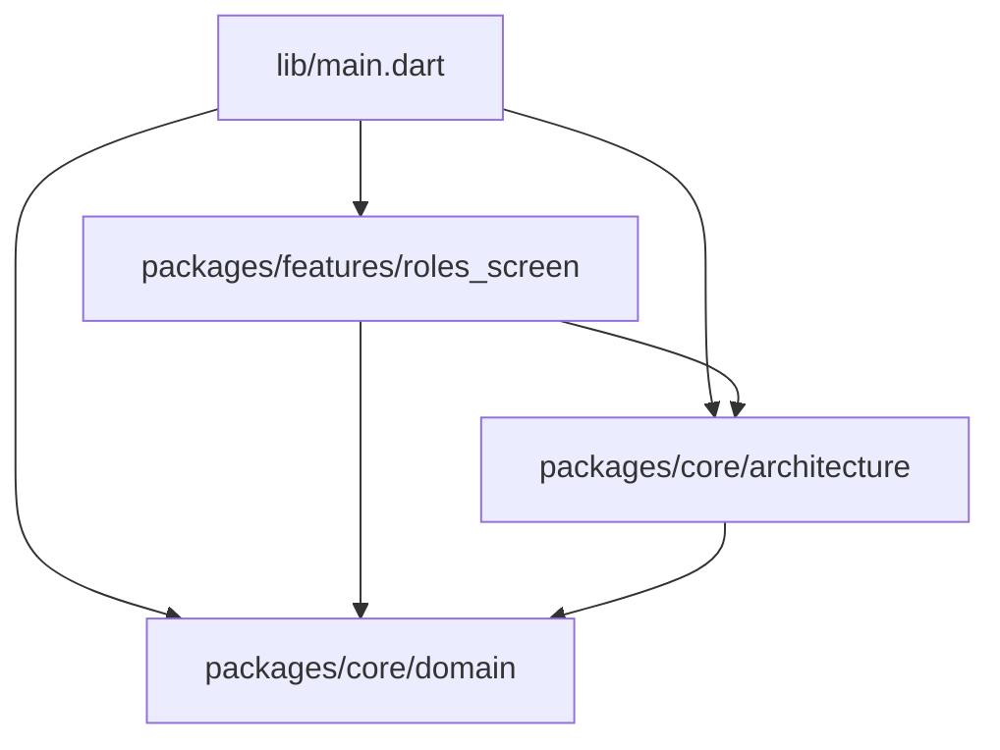

# Spy Game (Flutter Modular Project)

[](https://github.com/USER/myspygame/actions/workflows/ci.yml)
[](https://opensource.org/licenses/MIT)

A showcase repository demonstrating a professional approach to Flutter development. This project implements a modular architecture designed for scalability, testability, and team-based production environments.

## 🚀 Overview

This repository is built with the mindset of a **Lead Engineer**:

- **Strict Linting**: Automated code quality enforcement.
- **Modular Architecture**: Clear separation between core logic, UI, and domain.
- **Automated Testing**: Comprehensive unit and widget test coverage.
- **CI/CD Pipeline**: GitHub Actions for automated verification.

## 🏛 Architecture

The project follows a **Feature-Based Modular Architecture**. Each logical part of the application is isolated into its own package contained within the `packages/` directory.

### Module Breakdown



- **`core/architecture`**: Base classes for features, dependency injection helpers, and navigation services.
- **`core/domain`**: Pure business logic and data models. No UI dependencies.
- **`features/`**: Independent UI modules that depend on `core`.

For a deeper dive into design decisions, see [ARCHITECTURE.md](ARCHITECTURE.md).

## 🛠 Engineering Excellence

### Prerequisites

- [Flutter SDK](https://docs.flutter.dev/get-started/install) (>= 3.9.2)
- [GNU Make](https://www.gnu.org/software/make/) (recommended for automation)

### Quick Start

We use a `Makefile` to simplify common development tasks:

```bash
# Get dependencies in all packages
make get

# Run all tests
make test

# Run static analysis
make analyze
```

## 📄 Documentation

- [ARCHITECTURE.md](ARCHITECTURE.md) - Design patterns and modularity.
- [CONTRIBUTING.md](CONTRIBUTING.md) - How to contribute and coding standards.

## ⚖️ License

This project is licensed under the MIT License - see the [LICENSE](LICENSE) file for details.
